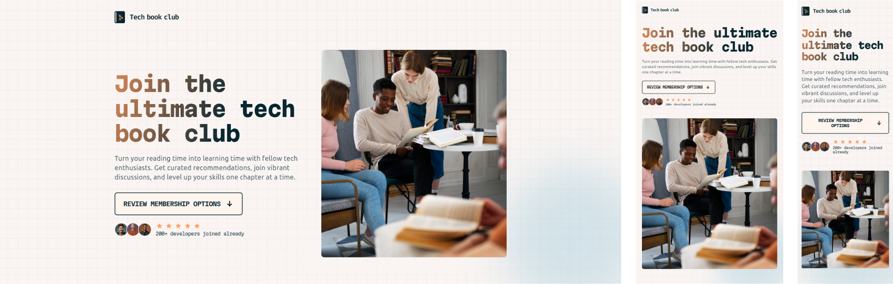

# Tech Book Club Landing Page

De uma olhada no prejeto funcionando [aqui](https://lucas-barbo.github.io/tech-book-club-landing-page/)

## Sobre o projeto

Este projeto faz parte do catalogo Frontend Mentor, o primeiro que estou desenvolvendo e publicando no github. Uma landing page simples e estatica, com foco no codigo HTML e CSS, e design responsivo.

## Por que?

Com esse projeto estou colocando em pratica meus conhecimentos e habilidades em desenvolvimento front-end, com enfase no CSS.

Usar o design pronto do Frontend Mentor me permite focar no codigo.

Com esse projeto também é desenvolvido sobre a metodologia BEM para estrutura do CSS e 7-1 parttern para organização dos arquivos CSS.

Obs: O 7-1 parttern é um modelo de organização usado no Sass, mas esse projeto usa CSS puro.